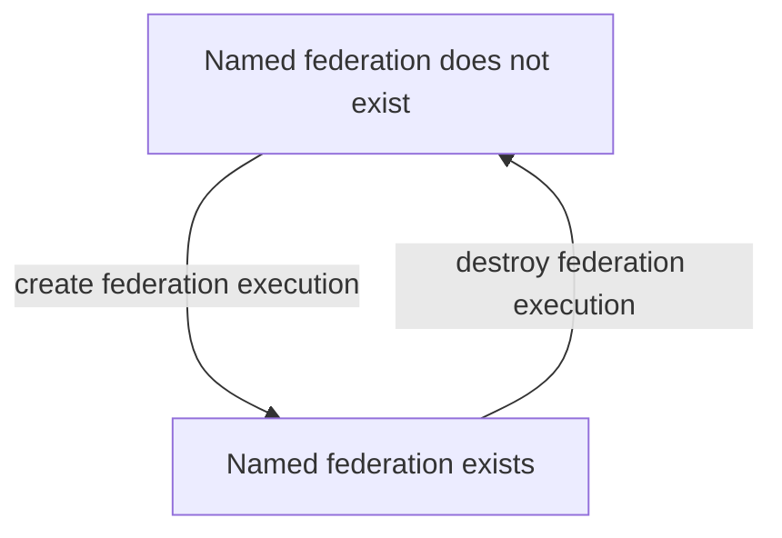

# Federation Management

Federation Management refers to generic functionality, rather than simulation domain specific functiontionality. There are three broad areas within federation management:

## Federation/federate lifecycle

Services exist to create and destroy federations and to allow federates to join to, and resign from, those federations.

## Synchronisation points

Synchonisation points serve, as their name implies, to synchronise, or checkpoint, the state of the federates in a federation. While the processes for registering and being informed of synchronisation points are generic, and therefore here as federation management services, their specifics of how they are use is tied to the semantics of the federation being run.

## Save/restore

These services are used to request federates and the RTI save and restore their state.
